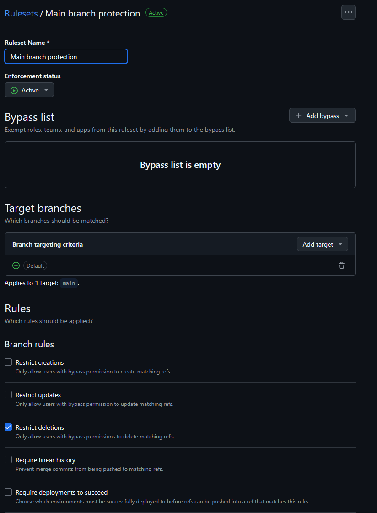
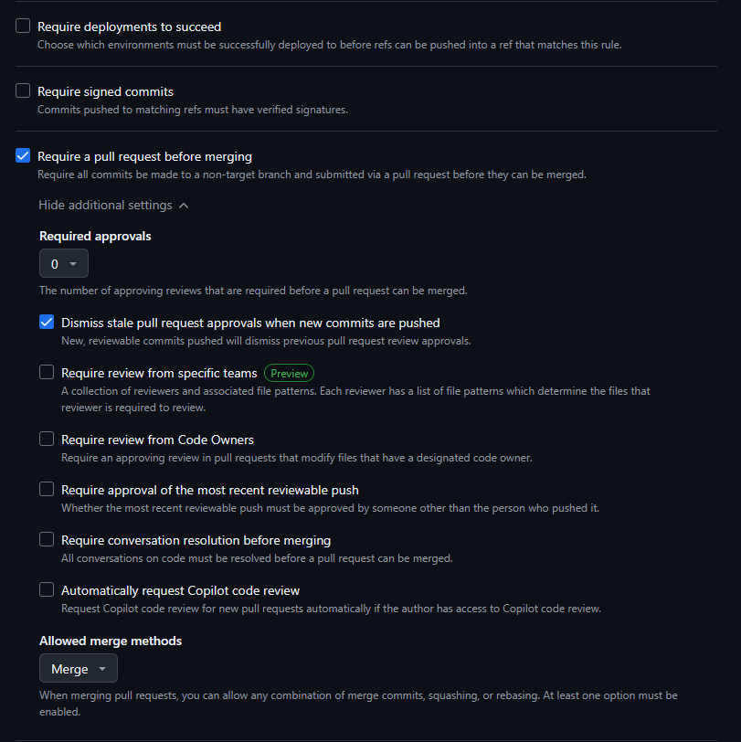
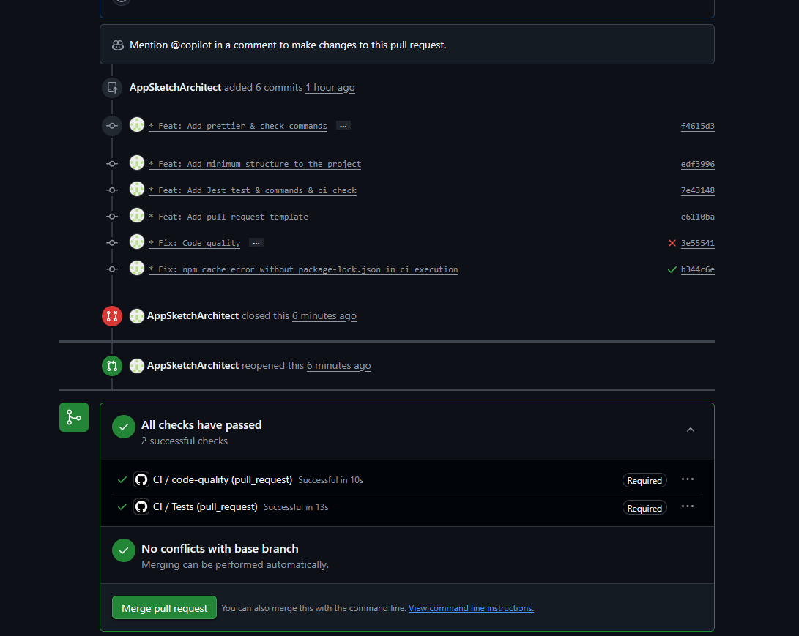
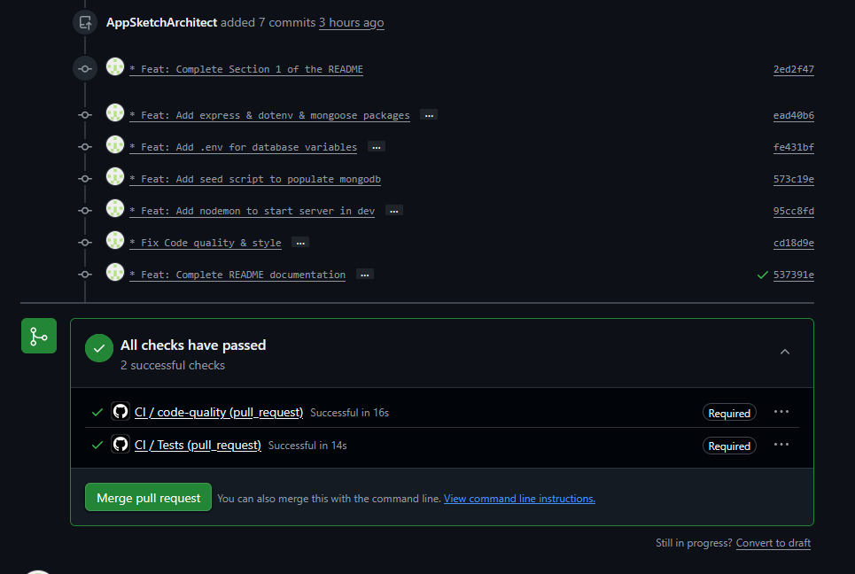

## Section 1

### Explication du workflow ci.yml

Le workflow ci.yml permet de vérifier

- S'il n'y a pas d'erreurs dans le code
- Si le code à bien été formatté
- Si l'ensemble des tests passent

Ces vérifications sont faites via 2 jobs expliqués plus en détails dans la deuxième Section.

### Protection de la branche main

J'utilise ces 2 jobs dans une règle de protection de la branche main lors des pull requests.

Configuration:




Ces règles sont importantes pour vérifier que le code déployé par les développeurs est fonctionnel, mais aussi pour vérifier que le code est stylisé selon les règles du projet.

### Création d'une pull request

- Pour la création d'une pull request, l'utilisateur devra se rendre sur github et faire "Compare & pull request".
- Ensuite l'utilisateur aura une description préremplie grâce au template "pull_request_template.md" à remplir.
- L'éxecution des Github Actions s'effectuerons (ci.yml) et acceptera ou non la pull request.

## Section 2

### Badges de status des pull requests

Pull Request n°1


Pull Request n°2


### Explication des jobs effectués

Chaque job va être initialisé dans une instance Ubuntu sur Github. Ces instances devront s'initialiser avec leurs dépendances pour fonctionner (Décrites par job unitairement). Après certaines fonctions seront executées pour faire des tests (Fonctions décrites unitairement par job aussi), et enfin en fonction du resultat des tests les jobs seront validés.

#### Job "code-quality"

Dépendances:

- npm

Fonctions:

- npm run lint
- npm run dev

#### Job "tests"

Dépendances:

- npm
- mongodb

Fonctions:

- npm run test

### Required checks et leur rôle

- Code-quality
  - Sert à s'il n'y a pas d'erreurs dans le code
  - Sert à vérifier si le code à bien été formatté
- Tests
  - Sert à vérifier la non régréssion et le bon fonctionnement du code (Vérifie aussi la couverture > 70%)

## Section 3

### Prérequis

- Docker
- Node

### Installation

Dupliquer le repository

```
git clone https://github.com/AppSketchArchitect/GitActionsEval
```

Initialisation de npm

```
npm i
```

Ajout des variables d'environnement (.env)

Initialisation de MongoDB

```
docker compose up -d
```

### Variables d'environnement

Voici une structure du fichier d'environnement nécessaire au projet

```
SERVER_PORT=xxxx

MONGO_HOST=xxxxxxxx
MONGO_PORT=xxxx
MONGO_DB_NAME=xxxxxxxx

MONGO_USERNAME=xxxxxxxx
MONGO_PASSWORD=xxxxxxxx
```

### Commandes disponibles

Qualité du code

```
npm run lint
npm run lint:fix (Optionnelle)
```

Style du code

```
npm run format:check
npm run format
```

Lancement des tests

```
npm run test
```

Lancement du serveur

```
npm run start (Prod)
npm run dev (Dev)
```

### Exemples d'appels API

#### Health Check

```
GET http://xxxxxxxx:xxxx/health
Response:
{
    "status": "ok"
}
```

#### RequestTypeList

```
GET http://xxxxxxxx:xxxx/api/request-types
Response:
[
    {
        "code": "CODE_EXAMPLE",
        "name": "NAME_EXAMPLE",
        "description": "DESCRIPTION_EXAMPLE",
        "priority": "high",
        "category": "CATEGORY_EXAMPLE",
        "estimatedResponseTime": 24,
        "isActive": true
    },
    ...
]
```

#### RequestType

```
GET http://xxxxxxxx:xxxx/api/request-types/:id
Response:
{
    "code": "CODE_EXAMPLE",
    "name": "NAME_EXAMPLE",
    "description": "DESCRIPTION_EXAMPLE",
    "priority": "high",
    "category": "CATEGORY_EXAMPLE",
    "estimatedResponseTime": 24,
    "isActive": true
}
```

#### CreateRequestType

```
POST http://xxxxxxxx:xxxx/api/request-types
Request:
{
    "code": "CODE_EXAMPLE",
    "name": "NAME_EXAMPLE",
    "description": "DESCRIPTION_EXAMPLE",
    "priority": "high",
    "category": "CATEGORY_EXAMPLE",
    "estimatedResponseTime": 24,
    "isActive": true
}
Response:
{
    "_id": "ID_EXAMPLE",
    "code": "CODE_EXAMPLE",
    "name": "NAME_EXAMPLE",
    "description": "DESCRIPTION_EXAMPLE",
    "priority": "high",
    "category": "CATEGORY_EXAMPLE",
    "estimatedResponseTime": 24,
    "isActive": true,
    "__v": 0,
    "createdAt": "2000-00-00T00:00.000Z",
    "updatedAt": "2000-00-00T00:00.000Z",
}"
```

## Section 4

### Arborescence
